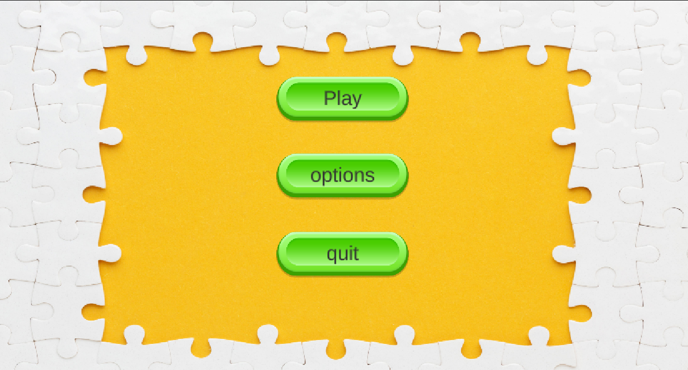
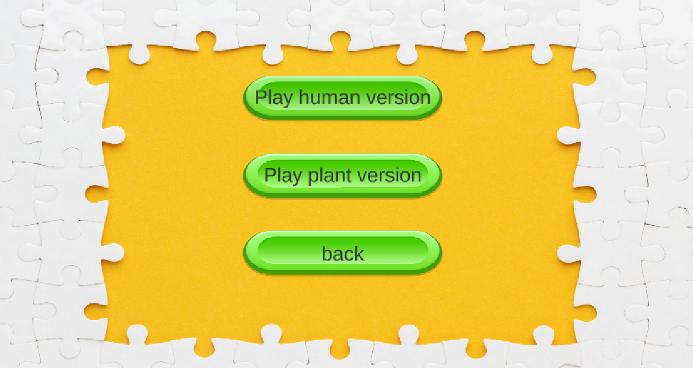
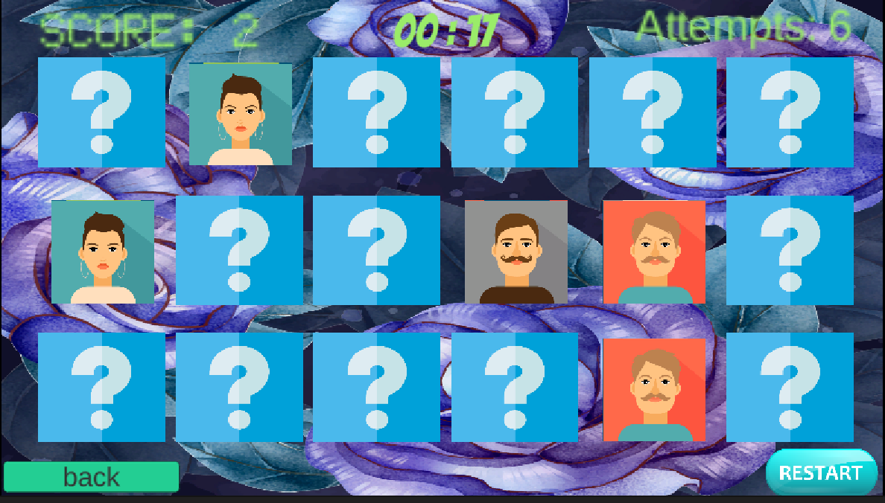
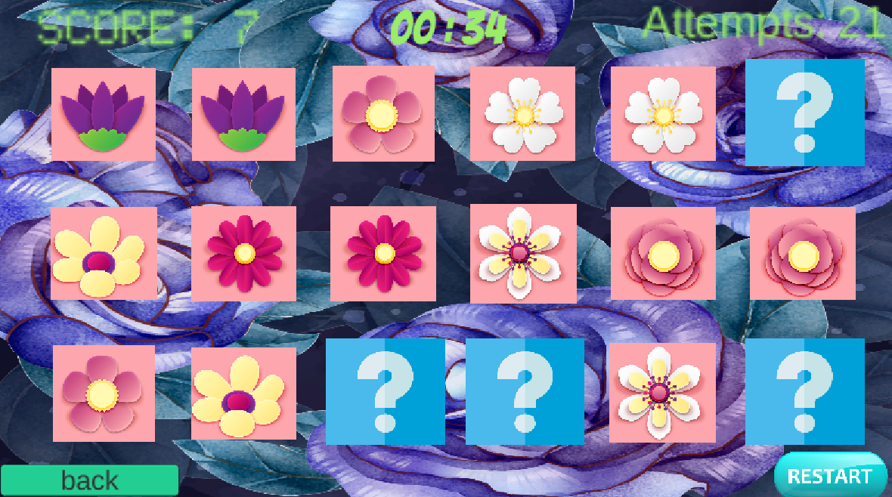

# Memory-game-in-Unity

# Dutch_translation_Memory-game_in_Unity

### Where to find English translation

You can either scroll down or click here: [English_Memory_game-in_Unity](#English_translation_Memory-game_in_Unity)

        

## Het doel:

De opdracht begon als een zelf bedachte offerte.

De Offerte die ik bedachte was dat een Ziekenhuis met dimensie patiënten een leuke manier wouden hebben om geheugen te testen.

Ik besloot er een Memory game van te maken waar de tijd, het aantal pogingen en het aantal punten per set gevonden werden weergeven, op deze manier kon je visueel zien hoelang het duurde en hoe vaak er een foute keuze was genomen.

            

## De feedback:

Ik heb later in mijn project een familie lid van iemand met dimensie voor feedback gevraagd, hier kwam het volgende uit als feedback:
- maak de plaatjes groter.
- maak een tweede thema naast mensen zoals planten.

            

## De gameplay

De game begint met een start scherm "Play" en "Quit" werken maar Opties was een placeholder voor de toekomst van de game:

    

Ik laat nu de normale stroom van de Game dus dit zie je als je op "Play" klikt:

    

vanaf dit punt kan je een van de twee kiezen beiden leiden tot de zelfde game met een anderen plaatjes thema:

    

Je kan hier de Video bekijken op YouTube hij is wel "unlisted" https://www.youtube.com/watch?v=jnIM4g-v_jQ

            